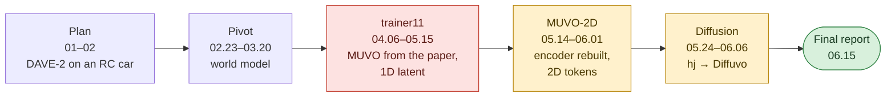
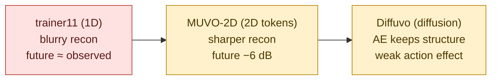
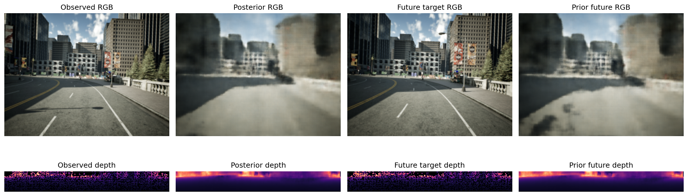
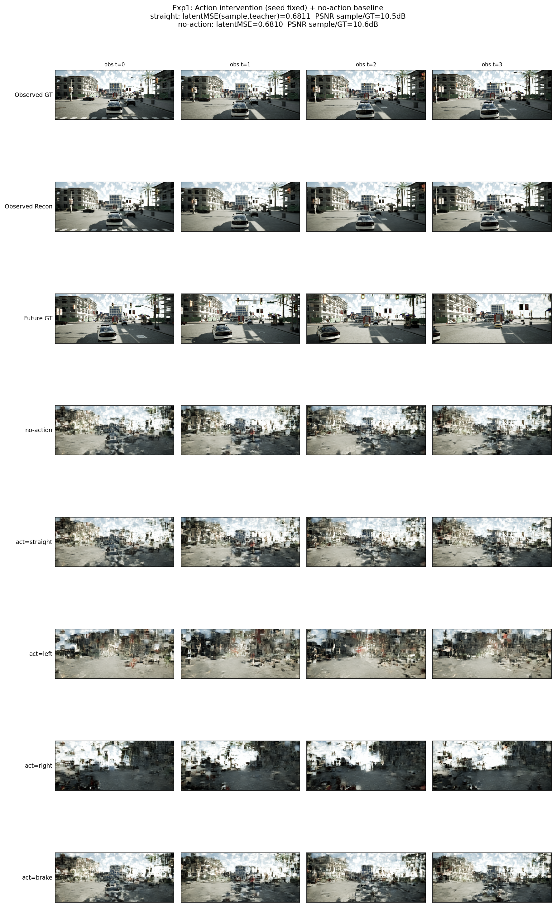
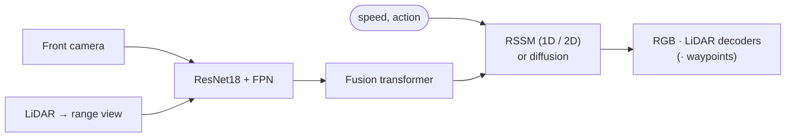

# Alpha Project 2026 — A MUVO-style Camera + LiDAR World Model on CARLA

**English** | [한국어](README_ko.md)

A four-person undergraduate team's one-semester driving **world model**  
Camera + LiDAR fused, latent state rolled forward under the action, future frames decoded · MUVO rebuilt from the paper, three model generations

| | |
|---|---|
| Program | Kookmin University 2026-1 **Alpha Project** (student-designed, team 29) · 15 weeks · autonomous-driving vision lab advisor |
| Title | Vision-based Autonomous Driving |
| Team | Chaeyeon Kim (lead), Sihyeon Park, Hyojeong Oh, Yoonju Jeong |
| Stack | PyTorch · Lightning (4-GPU DDP) · CARLA dataset (Hugging Face, Arrow) · TensorBoard, ClearML · Claude Code, Codex |
| Result | Three pipelines (1D RSSM, 2D-token RSSM, latent diffusion) · **133 logged runs** · blurry future · **action barely changes the future** |

## The Story in One Picture



| | |
|---|---|
| Goal | 4 past frames (camera + LiDAR) + action → next 2–4 frames, ~2 Hz |
| Held us back | Encoder drifted from MUVO, spatial tokens averaged away · future not evaluated at first · training-loop bugs · validation on training data |
| Learned | A world model must change its future when the action changes · our models did so weakly at best |

## Models and Results



| Model | Core idea | Best full-data result | Verdict |
|---|---|---|---|
| **trainer11** (1D) | Pooled 1D vector, RSSM h256 / z128, future loss | PSNR 14.4 / 16.5 dB · future 13.7 / 16.3 · Chamfer 1.53 / 1.30 | Blurry even on observed frames |
| **MUVO-2D** | 368 2D tokens, ConvGRU + transformer-decoder RSSM | Observed 21.5 / 22.0 dB · future 15.3 / 17.2 · Chamfer ≈ 2.2–2.5 m | Sharper, future −6 dB, LiDAR bands |
| **Diffuvo** WM / AR | Frozen AE + DiT denoiser, action CFG, RGB out | AE 22.5 / 23.1 dB · v-MSE 0.29–0.36 (best 0.289) | Mosaic future, action effect only at CFG ≥ 2 |

- PSNR pairs = RL / DS, two validation runs named after MUVO's splits (`validation_run_008` / `_024`)
- 1D and 2D trained with different objectives · resolution, frame rate and LiDAR differ from the paper
- All runs: [`results/experiment_log.csv`](results/experiment_log.csv) (133 rows, 103 distinct runs)

| trainer11, full data | Diffuvo, action intervention |
|---|---|
|  |  |
| Smeared posterior and prior · dense LiDAR | Rows 4–8: no action, straight, left, right, throttle 0 · same seed, CFG 3 |

## System



| Part | trainer11 | MUVO-2D | Diffuvo |
|---|---|---|---|
| Frames | 4 past + 4 future, TBPTT | 4 + 2, zero state per window | WM 4 + 4 · AR 4 + 2 |
| Encoder | ResNet18 + top-down FPN, pooled | ResNet18 + bottom-up FPN, LiDAR stride 16 | Same as MUVO-2D, frozen |
| Dynamics | GRU RSSM on a vector | ConvGRU + transformer-decoder RSSM on tokens | DiT denoiser in latent space |
| Training | Reconstruction + future loss | Reconstruction only | AE L1, then v-MSE |
| Output | RGB, LiDAR | RGB, LiDAR (+ waypoints) | RGB |

| Data | |
|---|---|
| Source | Hugging Face CARLA autopilot dataset · 22 train / 3 val / 3 test runs · ~75,600 frames at 4 Hz |
| LiDAR | 32-ch / 80 m → range view over [−30°, 10°] (MUVO: 64-ch / 100 m) |
| Dropped in our conversion | Ego pose, yaw, brake |

## Team

|  |  |  |  |
|:---:|:---:|:---:|:---:|
| **Chaeyeon Kim**<br/>[@ChaeYeonKim0204](https://github.com/ChaeYeonKim0204) | **Sihyeon Park**<br/>[@kha-2](https://github.com/kha-2) | **Hyojeong Oh**<br/>[@ohhyojeong](https://github.com/ohhyojeong) | **Yoonju Jeong**<br/>[@yoonju04](https://github.com/yoonju04) |
| **Team lead**<br/>DAVE-2, data, trainer<br/>Server, Tailscale access<br/>Encoder rebuild, MUVO-2D | DAVE-2 experiments<br/>Image decoder, trainer<br/>MUVO-2D experiments | LiDAR decoder<br/>Diffusion design<br/>Diffuvo WM / AR | Sequence model, TBPTT<br/>No-future bug<br/>Waypoint head |

## Contributions

### Participation by Area

◎ led · ○ actively contributed · △ took part

| Area | **Chaeyeon Kim** | **Sihyeon Park** | **Hyojeong Oh** | **Yoonju Jeong** |
|---|:---:|:---:|:---:|:---:|
| Program operations and reports | ◎ | ○ | ○ | ○ |
| Literature and direction | ○ | ◎ | ○ | ○ |
| DAVE-2 experiments | ◎ | ○ | | |
| Dataset and data pipeline | ◎ | ○ | △ | ○ |
| Encoders and sensor fusion | ◎ | ○ | ○ | ○ |
| Sequence model, RSSM, TBPTT | ○ | ○ | △ | ◎ |
| Decoders | ○ | ◎ | ◎ | ○ |
| Trainer, server and remote access | ◎ | ○ | △ | ○ |
| Debugging and code review | ◎ | ○ | ○ | ◎ |
| MUVO-2D | ◎ | ◎ | ○ | ○ |
| Waypoint head | | △ | | ◎ |
| Diffusion (hj, Diffuvo) | | △ | ◎ | |

### Key Achievements

| Member | Key achievement | Why it mattered |
|---|---|---|
| **Chaeyeon Kim** | **Encoder taken apart against MUVO** (05.14) → MUVO-2D port | Found why every 1D model was blurry · observed PSNR 14.4 → 21.5 dB (RL) |
| | **Data owner end to end**: data collection, time-series preprocessing, EDA · 4 Hz rate, LiDAR FOV, schema all traced by her | Every data-side bug and fix went through her |
| | **Tailscale SSH access**, laptop → campus WSL → GPU server (2–3 days) | Whole team could run on the GPU server from anywhere |
| **Sihyeon Park** | **Full `WorldModelTrainer` + image decoder** (04.30) | First trainer11 training loop |
| | MUVO-2D full-data runs and LR tuning (05.29) | First full-data numbers for the 2D model |
| **Hyojeong Oh** | **Diffusion line**: DWM → hj design → Diffuvo WM / AR (05.24–06.06) | The project's only action-conditioned generative model and action test |
| | LiDAR decoder (04.30) · 2D latent noted in the week-2 MUVO review | LiDAR branch of trainer11 |
| **Yoonju Jeong** | **Found that the decoder never produced the future** (04.30) | Turned a reconstruction model into a world model |
| | **RSSMTD + GRU waypoint head** (05.25) | Only trajectory output of the project |

### Highlights by Member

| Member | Highlights |
|---|---|
| **Chaeyeon Kim**<br/>Team lead | • Application, plan, reports, meeting notes<br/>• **Led the DAVE-2 experiments** (DAVE-2, +LSTM, +RSSM)<br/>• **Data end to end**: data collection, preprocessing, EDA · 4 Hz rate, LiDAR FOV<br/>• trainer11 restructure, review rounds, 4-GPU DDP run<br/>• **Tailscale SSH access**: laptop → campus WSL → GPU server, shared with the team<br/>• **Encoder take-apart against MUVO (05.14)** → MUVO-2D port, audits, reviews |
| **Sihyeon Park** | • World Models summary, trajectory papers<br/>• DAVE-2 experiments (with Chaeyeon Kim)<br/>• MUVO data module, transition design<br/>• **Image decoder, full `WorldModelTrainer`**<br/>• Meeting materials · MUVO-2D comparison, full-data runs |
| **Hyojeong Oh** | • MUVO review (2D latent noted in week 2), MILE<br/>• **LiDAR decoder**<br/>• Code comparison with MUVO<br/>• **DWM → diffusion design** (DiT, v-prediction, action CFG)<br/>• **Diffuvo WM / AR**: frozen AE + DiT, rebalancing, CFG probes |
| **Yoonju Jeong** | • Revised-plan body, Dreamer as lead candidate<br/>• Fusion → RSSM `forward()`, `trainer11.ipynb`, TBPTT<br/>• **Found the decoder never produced the future**<br/>• Encoder pooling fix · **RSSMTD + waypoint head** |

Who did what and when: [docs/contributions.md](docs/contributions.md)

## Key Problems

| Problem | Cause | What we did |
|---|---|---|
| Future never checked | Posterior-only decoding, no future evaluation | Future loss (05.02) · MUVO's scheme in MUVO-2D (05.20) |
| Blur, even on one window | Encoder drift, tokens averaged into one vector | Encoder take-apart (05.14) → MUVO-2D |
| Wrong training signal | TBPTT overlap, free-bits floor, action off by one, one-file "all data", LiDAR pitch range | Review rounds, data checks (04.30–05.15) |
| LiDAR dominated the loss | LiDAR xyz ~77 % of the loss | Reweighting, smaller targets |
| Validation on training data | Defaults and copied code, three times | Fixed 05.02, 05.14, 05.25 |
| Action barely mattered | One unnormalised action (WM), redundant history (AR), 42 % stationary frames | Diagnosed, fix not run |
| No ego pose | Dropped in our conversion | Bicycle-model waypoints |

## Post-mortem

- **Open question**: does changing the action change the predicted future?
- Each generation fixed the previous one's visible symptom (blur, then spatial detail)
- Action test only in the last two weeks · passed weakly at best

Full analysis, model lineage and lessons: [docs/postmortem.md](docs/postmortem.md)

## Quick Start

```bash
conda env create -f kcy-alpha.yml && conda activate kcy-alpha   # CUDA 11.8 + PyTorch

# Arrow files from the Hugging Face dataset under $CARLA_ARROW_ROOT
export CARLA_ARROW_ROOT=/path/to/processed ALPHA26_ROOT=$PWD
python scripts/build_arrow_manifest.py --root $CARLA_ARROW_ROOT
python scripts/build_arrow_window_index.py --root $CARLA_ARROW_ROOT \
  --out $CARLA_ARROW_ROOT/arrow_window_index.pkl \
  --seq-len 8 --stride 8 --sample-every-n 2 --frame-step 5

# trainer11, full data on 4 GPUs (--batch-size is per GPU)
python scripts/train_full_trainer11_server.py --steps 150000 --devices 4 \
  --strategy ddp_find_unused_parameters_true --batch-size 2 \
  --window-index $CARLA_ARROW_ROOT/arrow_window_index.pkl --run-name <name>

# MUVO-2D
python scripts/model_variants/train_muvo_2D.py --help
```

Dataset: [`immanuelpeter/carla-autopilot-multimodal-dataset`](https://huggingface.co/datasets/immanuelpeter/carla-autopilot-multimodal-dataset) · checkpoints not in the repository

## Repository

| Folder | Contents |
|---|---|
| `notebooks/` | trainer11 notebooks (source of the definitions), prototypes, evaluation |
| `scripts/` | trainer11 server CLI, dataset index builders, evaluation · `model_variants/`: 1D `_muvo`, 2D `_muvo_2D` |
| `diffuvo/` | Diffuvo `WM` (joint denoiser), `AR` (frame-wise autoregressive) |
| `experiments/` | `hj` (single-stage diffusion), `yj` (RSSMTD + waypoint head) |
| `results/` | `experiment_log.csv`, figures |
| `docs/` | These write-ups + working notes (paper translation, code audits, MUVO-2D notes) |

## Docs

- [docs/contributions.md](docs/contributions.md): each member's work with dates
- [docs/postmortem.md](docs/postmortem.md): root causes, model lineage, troubleshooting log, lessons
- [docs/timeline.md](docs/timeline.md): planning, pivot, development, wrap-up
- [docs/repository.md](docs/repository.md): folder tree, workflow, third-party sources
