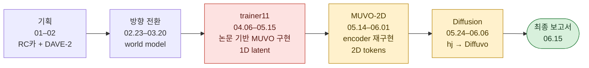
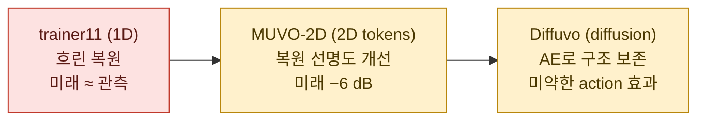
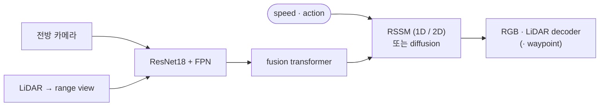

# Alpha Project 2026 — CARLA 기반 MUVO 방식 카메라 + LiDAR world model

[English](README.md) | **한국어**

학부생 4인 팀의 한 학기 주행 **world model** 프로젝트

- 카메라 + LiDAR 융합 · action에 따른 latent 상태 전개 · 미래 프레임 복원 · 논문 기반 MUVO 재구현 · 3세대 모델

| | |
|---|---|
| 프로그램 | 국민대학교 2026-1 **알파프로젝트**(학생 설계 · 29팀) · 15주 · 자율주행 비전 연구실 교수님 지도 |
| 주제 | 비전 기반 자율주행 |
| 팀 | 김채연(팀장) · 박시현 · 오효정 · 정윤주 |
| 기술 | PyTorch · Lightning(4-GPU DDP) · CARLA 데이터셋(Hugging Face · Arrow) · TensorBoard · ClearML · Claude Code · Codex |
| 결과 | 3개 파이프라인(1D RSSM · 2D-token RSSM · latent diffusion) · **기록된 run 133건** · 흐린 미래 · **action 변화에 거의 반응하지 않는 미래** |

## 한눈에 보는 과정



| | |
|---|---|
| 목표 | 과거 4프레임(카메라 + LiDAR) + action → 다음 2–4프레임 · 약 2 Hz |
| 주요 문제 | MUVO와 다른 encoder · 평균 연산으로 소실된 공간 token · 초기 미래 평가 누락 · 학습 루프 버그 · 학습 데이터로 validation |
| 배운 점 | action 변화에 따라 미래가 달라져야 하는 world model · 자체 모델의 반응은 기껏해야 미약함 |

## 모델과 결과



| 모델 | 핵심 구조 | 전체 데이터 최고 결과 | 평가 |
|---|---|---|---|
| **trainer11** (1D) | pooling한 1D 벡터 · RSSM h256 / z128 · future loss | PSNR 14.4 / 16.5 dB · 미래 13.7 / 16.3 · Chamfer 1.53 / 1.30 | 관측 프레임도 흐림 |
| **MUVO-2D** | 2D token 368개 · ConvGRU + transformer-decoder RSSM | 관측 21.5 / 22.0 dB · 미래 15.3 / 17.2 · Chamfer ≈ 2.2–2.5 m | 선명도 개선 · 미래 −6 dB · LiDAR 띠 |
| **Diffuvo** WM / AR | 고정 AE + DiT denoiser · action CFG · RGB 출력 | AE 22.5 / 23.1 dB · v-MSE 0.29–0.36(최저 0.289) | 모자이크 형태의 미래 · CFG ≥ 2에서만 action 효과 |

- PSNR 쌍 = RL / DS · MUVO split 이름을 따른 validation run 2개(`validation_run_008` / `_024`)
- 1D · 2D 학습 목표 상이 · 해상도 · frame rate · LiDAR도 논문과 상이
- 전체 run: [`results/experiment_log.csv`](results/experiment_log.csv) · 133행 · 서로 다른 run 103개

| trainer11 · 전체 데이터 | Diffuvo · action 개입 |
|---|---|
|  |  |
| 번진 posterior · prior · 빽빽한 LiDAR | 4–8행: action 없음 · 직진 · 좌회전 · 우회전 · throttle 0 · 동일 seed · CFG 3 |

## 시스템



| 구성 | trainer11 | MUVO-2D | Diffuvo |
|---|---|---|---|
| 프레임 | 과거 4 + 미래 4 · TBPTT | 4 + 2 · window마다 상태 0 초기화 | WM 4 + 4 · AR 4 + 2 |
| encoder | ResNet18 + top-down FPN · pooling | ResNet18 + bottom-up FPN · LiDAR stride 16 | MUVO-2D와 동일 · 고정 |
| dynamics | 벡터 기반 GRU RSSM | token 기반 ConvGRU + transformer-decoder RSSM | latent 공간 DiT denoiser |
| 학습 | reconstruction + future loss | reconstruction-only 학습 | AE L1 이후 v-MSE |
| 출력 | RGB · LiDAR | RGB · LiDAR(+ waypoint) | RGB |

| 데이터 | |
|---|---|
| 출처 | Hugging Face CARLA autopilot 데이터셋 · train 22 / val 3 / test 3 runs · 4 Hz 약 75,600프레임 |
| LiDAR | 32-ch / 80 m → [−30°, 10°] range view(MUVO: 64-ch / 100 m) |
| 자체 변환 중 누락 | ego pose · yaw · brake |

## 팀

|  |  |  |  |
|:---:|:---:|:---:|:---:|
| **김채연**<br/>[@ChaeYeonKim0204](https://github.com/ChaeYeonKim0204) | **박시현**<br/>[@kha-2](https://github.com/kha-2) | **오효정**<br/>[@ohhyojeong](https://github.com/ohhyojeong) | **정윤주**<br/>[@yoonju04](https://github.com/yoonju04) |
| **팀장**<br/>DAVE-2 · 데이터 · trainer<br/>서버 · Tailscale 원격 접속<br/>encoder 재구현 · MUVO-2D | DAVE-2 실험<br/>이미지 decoder · trainer<br/>MUVO-2D 실험 | LiDAR decoder<br/>diffusion 설계<br/>Diffuvo WM / AR | sequence model · TBPTT<br/>미래 출력 누락 발견<br/>waypoint head |

## 기여 내역

### 분야별 참여

- ◎ 주도 · ○ 적극 기여 · △ 참여

| 분야 | **김채연** | **박시현** | **오효정** | **정윤주** |
|---|:---:|:---:|:---:|:---:|
| 프로그램 운영 · 보고서 | ◎ | ○ | ○ | ○ |
| 논문 학습 · 방향 설정 | ○ | ◎ | ○ | ○ |
| DAVE-2 실험 | ◎ | ○ | | |
| 데이터셋 · 데이터 파이프라인 | ◎ | ○ | △ | ○ |
| encoder · 센서 융합 | ◎ | ○ | ○ | ○ |
| sequence model · RSSM · TBPTT | ○ | ○ | △ | ◎ |
| decoder | ○ | ◎ | ◎ | ○ |
| trainer · 서버 · 원격 접속 | ◎ | ○ | △ | ○ |
| 디버깅 · 코드 리뷰 | ◎ | ○ | ○ | ◎ |
| MUVO-2D | ◎ | ◎ | ○ | ○ |
| waypoint head | | △ | | ◎ |
| diffusion(hj · Diffuvo) | | △ | ◎ | |

### 대표 성과

| &nbsp;&nbsp;&nbsp;팀원&nbsp;&nbsp;&nbsp; | 대표 성과 | 의미 |
|:---:|---|---|
| **김채연** | **MUVO와 encoder 분해 비교**(05.14) → MUVO-2D 이식 | 1D 흐림 원인 규명 · PSNR 14.4 → 21.5 dB(RL) |
| | **데이터 전반 담당**: 데이터 수집 · 시계열 전처리 · EDA · 4 Hz 수집 빈도 · LiDAR FOV · 스키마 직접 추적 | 데이터 버그·수정 전담 |
| | **Tailscale SSH 원격 접속** 구축: 노트북 → 교내 WSL → GPU 서버(2–3일) | 팀 전체 원격 GPU 사용 |
| **박시현** | **`WorldModelTrainer` 전체 구현 + 이미지 decoder**(04.30) | trainer11 첫 학습 루프 |
| | MUVO-2D 전체 데이터 학습 · LR 튜닝(05.29) | 2D 첫 전체 데이터 수치 |
| **오효정** | **diffusion 계열**: DWM → hj 설계 → Diffuvo WM / AR(05.24–06.06) | 유일한 action 조건부 생성 모델 |
| | LiDAR decoder(04.30) · 2주차 MUVO 리뷰에서 2D latent 언급 | trainer11 LiDAR 분기 |
| **정윤주** | **decoder의 미래 출력 누락 발견**(04.30) | world model로 전환한 계기 |
| | **RSSMTD + GRU waypoint head**(05.25) | 유일한 궤적 출력 |

### 팀원별 주요 작업

| 팀원 | 주요 작업 |
|---|---|
| **김채연**<br/>팀장 | • 신청서 · 계획서 · 보고서 · 미팅 기록<br/>• **DAVE-2 실험 주도**(DAVE-2 · +LSTM · +RSSM)<br/>• **데이터 전반**: 데이터 수집 · 전처리 · EDA · 4 Hz 수집 빈도 · LiDAR FOV<br/>• trainer11 구조 개편 · 반복 리뷰 · 4-GPU DDP run<br/>• **Tailscale SSH 원격 접속** 구축: 노트북 → 교내 WSL → GPU 서버, 팀 공유<br/>• **MUVO와 encoder 분해 비교(05.14)** → MUVO-2D 이식 · 코드 점검 · 리뷰 |
| **박시현** | • World Models 요약 · 궤적 논문<br/>• 김채연과 DAVE-2 공동 실험<br/>• MUVO 데이터 모듈 · transition 설계<br/>• **이미지 decoder · `WorldModelTrainer` 전체 구현**<br/>• 미팅 자료 · MUVO-2D 비교 · 전체 데이터 run |
| **오효정** | • MUVO 리뷰(2주차 2D latent 명시) · MILE<br/>• **LiDAR decoder**<br/>• MUVO 코드 비교<br/>• **DWM → diffusion 설계**(DiT · v-prediction · action CFG)<br/>• **Diffuvo WM / AR**: 고정 AE + DiT · rebalancing · CFG 실험 |
| **정윤주** | • 수정 계획서 본문 · Dreamer 우선 후보 제안<br/>• fusion → RSSM `forward()` · `trainer11.ipynb` · TBPTT<br/>• **decoder의 미래 출력 누락 발견**<br/>• encoder pooling 수정 · **RSSMTD + waypoint head** |

- 시기별 담당 작업: [docs/contributions_ko.md](docs/contributions_ko.md)

## 주요 문제

| 문제 | 원인 | 대응 |
|---|---|---|
| 미래 출력 미확인 | posterior만 복원 · 미래 평가 없음 | future loss(05.02) · MUVO-2D에서 MUVO 방식 복원(05.20) |
| 단일 window에서도 흐림 | MUVO와 다른 encoder · token을 단일 벡터로 평균 | encoder 분해 비교(05.14) → MUVO-2D |
| 잘못된 학습 신호 | TBPTT 중첩 · free-bits 하한 · action 한 step 밀림 · 전체 데이터 run의 단일 파일 사용 · LiDAR pitch 범위 | 반복 리뷰 · 데이터 점검(04.30–05.15) |
| LiDAR에 치우친 loss | LiDAR xyz가 loss의 약 77 % | 가중치 조정 · target 축소 |
| 학습 데이터로 validation | 기본값 · 복사한 코드에서 3회 발생 | 05.02 · 05.14 · 05.25 수정 |
| 미약한 action 효과 | 정규화하지 않은 action 하나(WM) · 중복 history(AR) · 정지 프레임 42 % | 원인 진단 · 수정안 미실행 |
| ego pose 없음 | 자체 변환 중 누락 | bicycle-model waypoint |

## 회고

- **미해결 질문**: action 변경에 따른 예측 미래 변화 여부
- 세대별로 앞선 모델의 눈에 띄는 문제 개선 · 흐림, 이후 공간 세부 정보 부족
- 마지막 2주에만 action 실험 · 기껏해야 미약한 수준으로 통과

- 전체 분석 · 모델 계보 · 교훈: [docs/postmortem_ko.md](docs/postmortem_ko.md)

## 빠른 시작

```bash
conda env create -f kcy-alpha.yml && conda activate kcy-alpha   # CUDA 11.8 + PyTorch

# Hugging Face 데이터셋 Arrow 파일 위치: $CARLA_ARROW_ROOT
export CARLA_ARROW_ROOT=/path/to/processed ALPHA26_ROOT=$PWD
python scripts/build_arrow_manifest.py --root $CARLA_ARROW_ROOT
python scripts/build_arrow_window_index.py --root $CARLA_ARROW_ROOT \
  --out $CARLA_ARROW_ROOT/arrow_window_index.pkl \
  --seq-len 8 --stride 8 --sample-every-n 2 --frame-step 5

# trainer11 · GPU 4개로 전체 데이터 학습(--batch-size는 GPU당 크기)
python scripts/train_full_trainer11_server.py --steps 150000 --devices 4 \
  --strategy ddp_find_unused_parameters_true --batch-size 2 \
  --window-index $CARLA_ARROW_ROOT/arrow_window_index.pkl --run-name <name>

# MUVO-2D
python scripts/model_variants/train_muvo_2D.py --help
```

- 데이터셋: [`immanuelpeter/carla-autopilot-multimodal-dataset`](https://huggingface.co/datasets/immanuelpeter/carla-autopilot-multimodal-dataset) · 저장소에 checkpoint 미포함

## 저장소

| 폴더 | 내용 |
|---|---|
| `notebooks/` | trainer11 notebook(정의 원본) · prototype · 평가 |
| `scripts/` | trainer11 서버 CLI · 데이터셋 index 생성 · 평가 · `model_variants/`: 1D `_muvo` · 2D `_muvo_2D` |
| `diffuvo/` | Diffuvo `WM`(미래 프레임을 함께 처리하는 denoiser) · `AR`(프레임별 autoregressive) |
| `experiments/` | `hj`(single-stage diffusion) · `yj`(RSSMTD + waypoint head) |
| `results/` | `experiment_log.csv` · 그림 |
| `docs/` | 정리 문서 · 작업 노트 · 논문 번역 · 코드 점검 · MUVO-2D 노트 |

## 문서

- [docs/contributions_ko.md](docs/contributions_ko.md): 팀원별 작업 · 날짜
- [docs/postmortem_ko.md](docs/postmortem_ko.md): 근본 원인 · 모델 계보 · 문제 해결 기록 · 교훈
- [docs/timeline_ko.md](docs/timeline_ko.md): 기획 · 방향 전환 · 개발 · 마무리
- [docs/repository_ko.md](docs/repository_ko.md): 폴더 구조 · 작업 방식 · 외부 출처
