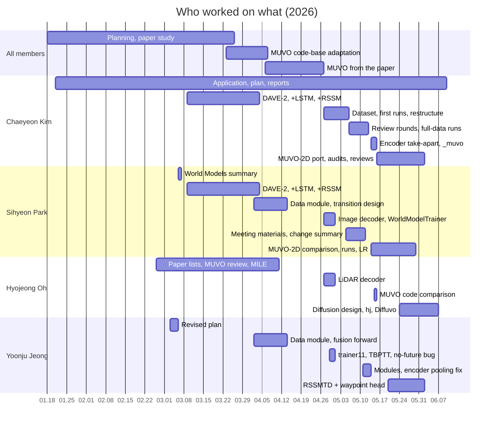

# Team Contributions

[← README](../README.md) · **English** | [한국어](contributions_ko.md)

Who worked on what, and when

## At a Glance

## Who Did What, When

### Planning and DAVE-2 (01–04.05)

| Date | Chaeyeon Kim | Sihyeon Park | Hyojeong Oh | Yoonju Jeong |
|---|---|---|---|---|
| 01.19–23 | Application, submission | Meeting notes | First meeting | Meetings, RC car + DAVE-2 plan |
| Planned roles | Data | DAVE-2 model | RC control | Integration, avoidance |
| 02.09–28 | Meeting set-up, RC hardware, Epona / DreamerV3, paper list | UniAD, DESIRE, SoPhie | World Models write-up, DriveDreamer, GAIA-1 | Dreamer as lead candidate |
| 03.03 | Plan intro, CARLA fallback | | | Plan body, role split |
| 03.04–06 | Output as action, SullyChen | World Models summary, GAIA-1 | 03.09 material draft | Offline-video task idea, RL analysis |
| 03.09–04.03 | **DAVE-2, +LSTM, +RSSM (lead)** | DAVE-2, +LSTM, +RSSM | MUVO review | E2E-CARLA survey |
| 03.23–31 | HF dataset, model spec | Environment setup | | TransFuser |
| 04.02 | | Data-module port | | Config triage, `CarlaDataset` |

### trainer11 (04.06–05.13)

| Date | Chaeyeon Kim | Sihyeon Park | Hyojeong Oh | Yoonju Jeong |
|---|---|---|---|---|
| 04.06–10 | YOLOv11-RGBT, implementation plan | Trajectory pipeline | MILE | WorldVLM |
| 04.13 | First forward pass | Transition design, encoder notebooks | | Fusion → RSSM `forward()` |
| 04.27–30 | Roles, time-series dataset, first run | Image decoder, `WorldModelTrainer` | LiDAR decoder | `trainer11.ipynb`, TBPTT, no-future bug |
| 05.02–05 | Stream TBPTT, validation split, restructure | Report wording | | |
| 05.06–08 | 4 Hz check, metrics, LiDAR fix, review rounds, 40-epoch run | 05.06 materials | Own part of materials | Own part of materials |
| 05.11–13 | Server CLI, 4-GPU run | Change summary, modules | | Modules, encoder pooling fix |

### MUVO-2D and Diffusion (05.14–06.06)

| Date | Chaeyeon Kim | Sihyeon Park | Hyojeong Oh | Yoonju Jeong |
|---|---|---|---|---|
| 05.14–15 | **Encoder take-apart**, `_muvo`, SSIM, 2D branch | Code check, weekend meeting | Code comparison | |
| 05.16–23 | MUVO-2D plan, port, audits | Difference list | | |
| 05.24 | Multi-agent review | | **DWM → diffusion direction** | UniAD |
| 05.25–28 | Fixes, alignment, evaluation bugs, 200-epoch analysis | RSSMTD overfit run, materials, to-do | **hj design, single-stage overfits** | **RSSMTD + waypoint head** |
| 05.29 | OneCycle fix | Full-data results, LR rerun | | |
| 05.29–06.06 | KL sweeps | Server contact | **Diffuvo WM / AR** | Waypoint write-up, LTP |

## Chaeyeon Kim

**Team lead** · key achievements: encoder take-apart → MUVO-2D, data end to end (collection, preprocessing, EDA), Tailscale SSH access for the team

| Area | Work | When |
|---|---|---|
| Program | Application, revised-plan intro and submission, weekly reports, advisor contact, meeting notes | 01–06 |
| Direction and data | Output as action · SullyChen and HF datasets · server model spec · implementation plan | 03–04 |
| DAVE-2 | **Led** DAVE-2, +LSTM, +RSSM experiments | 03.09–04.03 |
| trainer11 | Time-series dataset · stream TBPTT · restructure · metrics · manifest · experiment log | 04.29–05.07 |
| Data checks | **4 Hz from the collection script** · LiDAR projection fix · one-file "all data" run · 40-epoch run | 05.06–08 |
| Server | Notebook → CLI export · 4-GPU DDP run and analysis | 05.11–12 |
| Remote access | **Tailscale SSH**: laptop → campus WSL → GPU server via ProxyJump · always-on WSL · team access policy and guide · 2–3 days of work | ~05.18 |
| Encoder | **Took the encoder apart against MUVO** · `_muvo` branch · SSIM test · found the `2D` branch | 05.14–15 |
| MUVO-2D | Plan, port, audits, multi-agent review, upstream alignment, evaluation fixes | 05.16–05.29 |
| Records | `results/experiment_log.csv`, working notes in `docs/` | 05.07– |

## Sihyeon Park

**Key achievements**: full `WorldModelTrainer` + image decoder, MUVO-2D full-data runs

| Area | Work | When |
|---|---|---|
| Study | UniAD, DESIRE, SoPhie · World Models summary · GAIA-1, DriveDreamer · trajectory pipeline | 02–04 |
| Plan | First-meeting notes · encoder / autoencoder owner in the revised plan | 01.19, 03.03 |
| DAVE-2 | DAVE-2, +LSTM, +RSSM experiments (with Chaeyeon Kim) | 03.09–04.03 |
| MUVO port | Environment · data module · transformer-decoder transition design · encoder notebooks | 03.26–04.13 |
| trainer11 | **Image decoder** · full `WorldModelTrainer` (KL, multiscale losses, OneCycle) | 04.27–30 |
| Engineering | Change summary · modular layout with scheduler automation | 05.11 |
| Meetings | 05.06 and 05.27 materials · feedback summaries · to-do lists · pushed the 05.15 weekend meeting | 05 |
| MUVO-2D | Code comparison · difference list · RSSMTD overfit run · full-data results, LR rerun | 05.14–29 |

## Hyojeong Oh

**Key achievements**: diffusion line from DWM to Diffuvo WM / AR, LiDAR decoder

| Area | Work | When |
|---|---|---|
| Study | World Models write-up · **MUVO review (already noting the 2D latent)** · MILE · DWM | 02–05 |
| Records | 03.09 meeting material · meeting notes, Notion pages | 03– |
| trainer11 | LiDAR encoder embeddings · **LiDAR decoder** | 04.27–30 |
| Review | Code comparison with MUVO, wrong parts found | 05.15 |
| Diffusion | **DWM → action-conditioned latent diffusion** · hj design (DiT, v-prediction, action CFG, counterfactual probes) · single-stage overfits | 05.24–28 |
| Diffuvo | **WM**: frozen AE + DiT · rebalancing, latent-norm A / B, LR tests, CFG probes · **AR**: per-step action tokens | 05.29–06.06 |

## Yoonju Jeong

**Key achievements**: no-future bug found, RSSMTD + waypoint head

| Area | Work | When |
|---|---|---|
| Plan | Dreamer as lead candidate · revised-plan body, deliverable = model · RL analysis, dataset candidates | 02.28–03.06 |
| Data and model | Config triage, `CarlaDataset` · pre-fusion downsampling, fusion → RSSM `forward()` | 04.02–13 |
| Sequence model | `trainer11.ipynb`, TBPTT carry-over | 04.29 |
| Bug | **Decoder never produced the future** · loss fix, open questions | 04.30 |
| Encoder | Pooling removed, BasicBlock ×2 · modular layout | 05.11–13 |
| Waypoints | **RSSMTD + GRU waypoint head** · bicycle-model ground truth · ADE / FDE · LTP summary | 05.25–06.01 |

## Not in the Final Code

| Work | Who | Why not kept |
|---|---|---|
| DAVE-2, +LSTM, +RSSM | Chaeyeon Kim (lead), Sihyeon Park | Pre-pivot steering models, Notion only |
| MUVO code-base adaptation | Sihyeon Park, Yoonju Jeong | Tightly coupled code, replaced by a from-paper build |
| YOLOv11-RGBT, trajectory pipeline, WorldVLM, MILE | One each | Week-6 survey |
| Decoder shortcut, SSIM, 1D `_muvo` | Chaeyeon Kim | Train / imagine mismatch · negative result · superseded |

## Notes

- Sources: team chat, Notion pages, meeting memos, git history, run logs, `experiment_log.csv`, Codex logs, Claude memory notes
- Most meetings and much of the implementation done together · tables show what the records attribute to one person
- Much of the code and many reviews written with Claude and Codex · the person listed directed and checked the work
