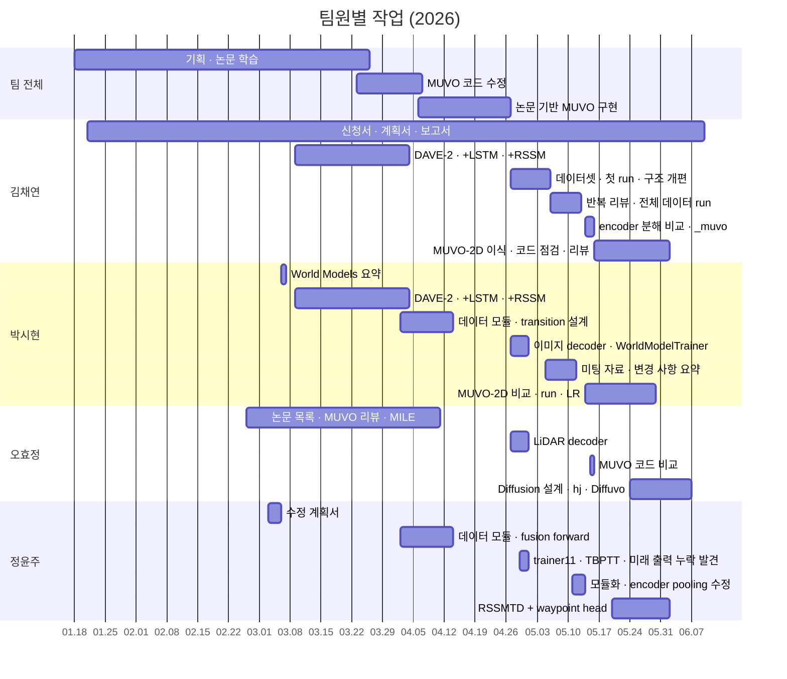

# 팀 기여 내역

[← README](../README_ko.md) · [English](contributions.md) | **한국어**

팀원별 담당 작업과 시기

## 전체 흐름

## 시기별 역할

### 기획과 DAVE-2 (01–04.05)

| 날짜 | 김채연 | 박시현 | 오효정 | 정윤주 |
|---|---|---|---|---|
| 01.19–23 | 신청서 작성 · 제출 | 미팅 기록 | 첫 미팅 참석 | 미팅 · RC카 + DAVE-2 계획 |
| 초기 역할 | 데이터 | DAVE-2 모델 | RC 제어 | 통합 · 회피 |
| 02.09–28 | 미팅 조율 · RC 하드웨어 · Epona / DreamerV3 · 논문 목록 | UniAD · DESIRE · SoPhie | World Models 정리 · DriveDreamer · GAIA-1 | Dreamer 우선 후보 제안 |
| 03.03 | 계획서 서론 · CARLA 대안 | | | 계획서 본문 · 역할 분담 |
| 03.04–06 | action 출력 정의 · SullyChen | World Models 요약 · GAIA-1 | 03.09 자료 초안 | 오프라인 영상 과제 제안 · RL 분석 |
| 03.09–04.03 | **DAVE-2 · +LSTM · +RSSM (주도)** | DAVE-2 · +LSTM · +RSSM | MUVO 리뷰 | E2E-CARLA survey |
| 03.23–31 | Hugging Face 데이터셋 · 모델 사양 | 환경 구성 | | TransFuser |
| 04.02 | | 데이터 모듈 이식 | | config 선별 · `CarlaDataset` |

### trainer11 (04.06–05.13)

| 날짜 | 김채연 | 박시현 | 오효정 | 정윤주 |
|---|---|---|---|---|
| 04.06–10 | YOLOv11-RGBT · 구현 계획 | 궤적 파이프라인 | MILE | WorldVLM |
| 04.13 | 첫 forward pass | transition 설계 · encoder notebook | | fusion → RSSM `forward()` |
| 04.27–30 | 역할 분담 · 시계열 데이터셋 · 첫 run | 이미지 decoder · `WorldModelTrainer` | LiDAR decoder | `trainer11.ipynb` · TBPTT · 미래 출력 누락 발견 |
| 05.02–05 | stream TBPTT · validation 분리 · 구조 개편 | 보고서 문구 | | |
| 05.06–08 | 4 Hz 확인 · 지표 · LiDAR 수정 · 반복 리뷰 · 40 epoch run | 05.06 자료 | 담당 파트 자료 | 담당 파트 자료 |
| 05.11–13 | 서버 CLI · 4-GPU run | 변경 사항 요약 · 모듈화 | | 모듈화 · encoder pooling 수정 |

### MUVO-2D와 Diffusion (05.14–06.06)

| 날짜 | 김채연 | 박시현 | 오효정 | 정윤주 |
|---|---|---|---|---|
| 05.14–15 | **encoder 분해 비교** · `_muvo` · SSIM · 2D branch | 코드 점검 · 주말 미팅 | 코드 비교 | |
| 05.16–23 | MUVO-2D 계획 · 이식 · 코드 점검 | 차이 목록 | | |
| 05.24 | multi-agent 리뷰 | | **DWM → diffusion 방향 설정** | UniAD |
| 05.25–28 | 수정 · upstream 구현에 맞춤 · 평가 버그 수정 · 200 epoch 분석 | RSSMTD overfit run · 자료 · 할 일 정리 | **hj 설계 · single-stage overfit** | **RSSMTD + waypoint head** |
| 05.29 | OneCycle 수정 | 전체 데이터 결과 · LR 조정 후 재실행 | | |
| 05.29–06.06 | KL sweep | 서버 관련 연락 | **Diffuvo WM / AR** | waypoint 문서 · LTP |

## 김채연

**팀장** · 대표 성과: encoder 분해 비교 → MUVO-2D · 데이터 전반(수집 · 전처리 · EDA) · 팀 Tailscale SSH 원격 접속

| 분야 | 작업 | 시기 |
|---|---|---|
| 운영 | 신청서 · 수정 계획서 서론 · 제출 · 주간 보고서 · 교수님 연락 · 미팅 기록 | 01–06 |
| 방향 · 데이터 | action 출력 정의 · SullyChen · Hugging Face 데이터셋 · 서버 모델 사양 · 구현 계획 | 03–04 |
| DAVE-2 | DAVE-2 · +LSTM · +RSSM 실험 **주도** | 03.09–04.03 |
| trainer11 | 시계열 데이터셋 · stream TBPTT · 구조 개편 · 지표 · manifest · 실험 로그 | 04.29–05.07 |
| 데이터 점검 | **수집 스크립트에서 4 Hz 확인** · LiDAR 투영 수정 · 전체 데이터 run의 단일 파일 버그 발견 · 40 epoch run | 05.06–08 |
| 서버 | notebook → CLI 추출 · 4-GPU DDP run · 분석 | 05.11–12 |
| 원격 접속 | **Tailscale SSH** 구축: 노트북 → 교내 WSL → ProxyJump로 GPU 서버 · WSL 상시 가동 · 팀 접근 정책 · 가이드 · 2–3일 소요 | 05.18 전후 |
| encoder | **MUVO와 encoder 분해 비교** · `_muvo` 분기 · SSIM 실험 · `2D` branch 발견 | 05.14–15 |
| MUVO-2D | 계획 · 이식 · 코드 점검 · multi-agent 리뷰 · upstream 구현에 맞춤 · 평가 수정 | 05.16–05.29 |
| 기록 | `results/experiment_log.csv` · `docs/` 작업 노트 | 05.07– |

## 박시현

**대표 성과**: `WorldModelTrainer` 전체 구현 + 이미지 decoder · MUVO-2D 전체 데이터 run

| 분야 | 작업 | 시기 |
|---|---|---|
| 학습 | UniAD · DESIRE · SoPhie · World Models 요약 · GAIA-1 · DriveDreamer · 궤적 파이프라인 | 02–04 |
| 계획 | 첫 미팅 기록 · 수정 계획서 encoder / autoencoder 담당 | 01.19, 03.03 |
| DAVE-2 | 김채연과 DAVE-2 · +LSTM · +RSSM 공동 실험 | 03.09–04.03 |
| MUVO 이식 | 환경 · 데이터 모듈 · transformer-decoder transition 설계 · encoder notebook | 03.26–04.13 |
| trainer11 | **이미지 decoder** · `WorldModelTrainer` 전체 구현(KL · multiscale loss · OneCycle) | 04.27–30 |
| 구현 정리 | 변경 사항 요약 · scheduler 자동화 포함 모듈 구성 | 05.11 |
| 미팅 | 05.06 · 05.27 자료 · 피드백 요약 · 할 일 목록 · 05.15 주말 미팅 추진 | 05 |
| MUVO-2D | 코드 비교 · 차이 목록 · RSSMTD overfit run · 전체 데이터 결과 · LR 조정 후 재실행 | 05.14–29 |

## 오효정

**대표 성과**: DWM부터 Diffuvo WM / AR까지의 diffusion 계열 · LiDAR decoder

| 분야 | 작업 | 시기 |
|---|---|---|
| 학습 | World Models 정리 · **MUVO 리뷰(초기부터 2D latent 명시)** · MILE · DWM | 02–05 |
| 기록 | 03.09 미팅 자료 · 미팅 기록 · Notion 페이지 | 03– |
| trainer11 | LiDAR encoder embedding · **LiDAR decoder** | 04.27–30 |
| 리뷰 | MUVO 코드 비교 · 오류 발견 | 05.15 |
| Diffusion | **DWM → action 조건부 latent diffusion** · hj 설계(DiT · v-prediction · action CFG · counterfactual 실험) · single-stage overfit | 05.24–28 |
| Diffuvo | **WM**: 고정 AE + DiT · rebalancing · latent-norm A / B · LR 실험 · CFG 실험 · **AR**: step별 action token | 05.29–06.06 |

## 정윤주

**대표 성과**: 미래 출력 누락 발견 · RSSMTD + waypoint head

| 분야 | 작업 | 시기 |
|---|---|---|
| 계획 | Dreamer 우선 후보 제안 · 수정 계획서 본문 · 모델을 결과물로 설정 · RL 분석 · 데이터셋 후보 | 02.28–03.06 |
| 데이터 · 모델 | config 선별 · `CarlaDataset` · fusion 전 downsampling · fusion → RSSM `forward()` | 04.02–13 |
| sequence model | `trainer11.ipynb` · TBPTT 상태 전달 | 04.29 |
| 버그 | **decoder의 미래 출력 누락 발견** · loss 수정 · 미해결 질문 정리 | 04.30 |
| encoder | pooling 제거 · BasicBlock ×2 · 모듈 구성 | 05.11–13 |
| waypoint | **RSSMTD + GRU waypoint head** · bicycle-model 정답 · ADE / FDE · LTP 요약 | 05.25–06.01 |

## 최종 코드에 남지 않은 작업

| 작업 | 담당 | 제외 이유 |
|---|---|---|
| DAVE-2 · +LSTM · +RSSM | 김채연(주도) · 박시현 | 방향 전환 전 조향 모델 · Notion에만 보관 |
| MUVO 코드 수정 | 박시현 · 정윤주 | 높은 코드 결합도 · 논문 기반 구현으로 대체 |
| YOLOv11-RGBT · 궤적 파이프라인 · WorldVLM · MILE | 1인 1개 | 6주차 조사 |
| decoder shortcut · SSIM · 1D `_muvo` | 김채연 | train / imagine 불일치 · 효과 없음 · 후속 모델로 대체 |

## 참고

- 출처: 팀 채팅 · Notion 페이지 · 미팅 메모 · git 이력 · run 로그 · `experiment_log.csv` · Codex 로그 · Claude memory 노트
- 미팅 대부분과 구현 상당 부분은 공동 작업 · 표는 기록상 개인에게 귀속된 작업 기준
- 코드 · 리뷰 상당 부분에 Claude · Codex 활용 · 표에 기재된 팀원이 작업 지시 · 검토 담당
