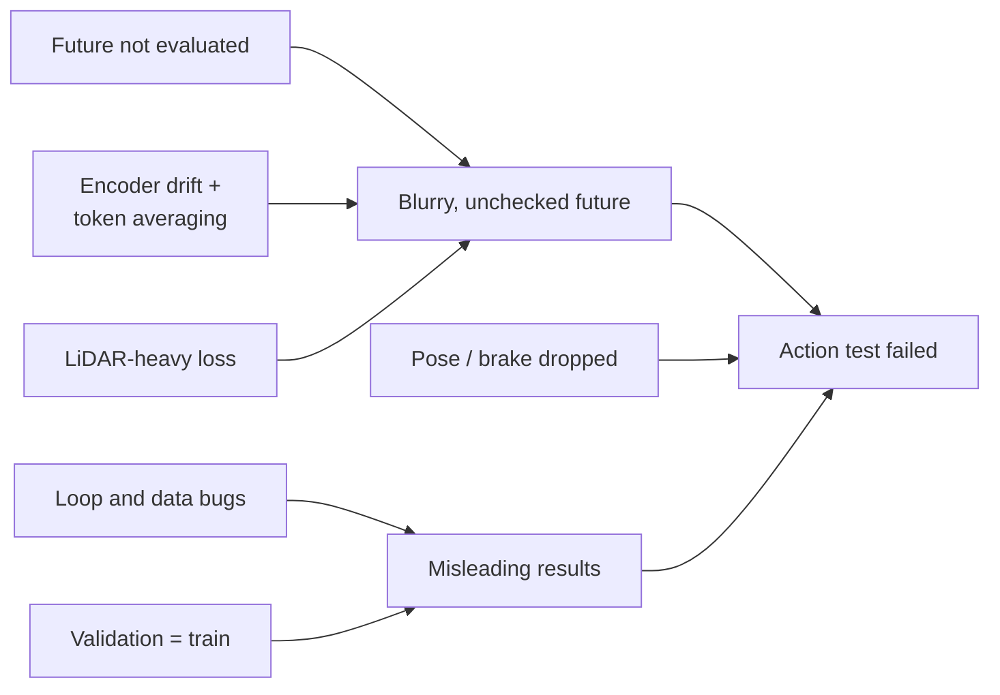
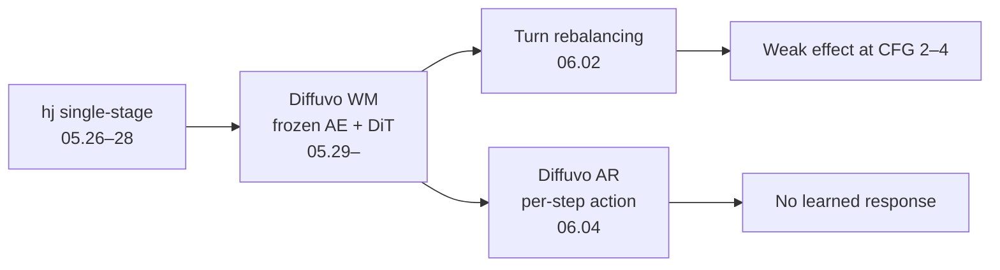
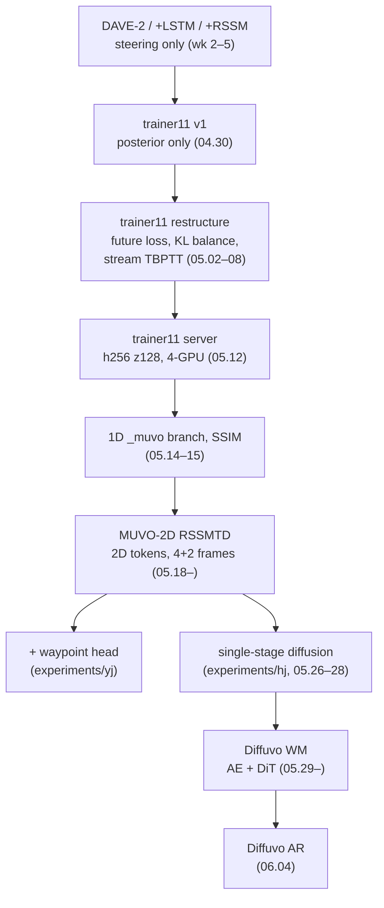

# Post-mortem

[← README](../README.md) · **English** | [한국어](postmortem_ko.md)

What held the world model back, how each problem was found, what we would do differently

## Summary

| # | Root cause | Effect | Found | Status |
|---|---|---|---|---|
| 1 | Future neither trained nor evaluated | Future output never checked | 04.30 | MUVO's scheme restored in MUVO-2D |
| 2 | Encoder drifted from MUVO, tokens averaged into one vector | Blur, even on one window | 04.30 flagged · 05.14 traced | Replaced by MUVO-2D |
| 3 | SSIM copied on a false premise | Checkerboard or more blur | 05.15 | Dropped |
| 4 | Training-loop and data bugs | Wrong signal, fake full-data runs | 05.02–08 | Fixed |
| 5 | LiDAR dominated the loss | RGB terms < 1 % of the loss | 05.07 · 05.12 | Partly reweighted |
| 6 | Validation on training data | Misleading numbers | 05.02 · 05.14 · 05.24 | Fixed each time |
| 7 | Action barely used | Same future for every action | 05.27 test · 06.01–06 | Open |
| 8 | Pose and brake dropped in conversion | Approximate waypoints, no brake | 05.27 | Bicycle-model approximation |

## 1. The Future Was Neither Trained Nor Evaluated

| | |
|---|---|
| Symptom | Training ran, reconstructions looked plausible, nothing measured the predicted future |
| Found (04.30) | Decoder decoded only the posterior; `imagine()` never ran · found by Yoonju Jeong |
| MUVO's way | Posterior reconstruction in training, prior through KL only, imagined future evaluated at validation |
| First fixes | Loss fixed in Yoonju Jeong's notebook (04.30), not carried into the main one · 05.02 restructure: 4 + 4 frames with a future loss, KL 1e-3 + balancing, speed input, LiDAR valid mask |
| Side effects | Decoder shortcut (05.02) broke train / imagine consistency, removed · valid mask filled LiDAR with bands until an empty-pixel penalty (05.05) |
| Back to MUVO (05.20) | MUVO-2D: reconstruction only, imagined future at validation · trainer11 kept the future loss, so 1D and 2D numbers come from different objectives |
| Lesson | Decide how the main output is evaluated before training |

## 2. The Bottleneck Was the Encoder Path, Not the Latent Size

| | |
|---|---|
| Symptom | Blurry RGB, even on a one-window overfit |
| Early warnings | 2D token latent in the week-2 MUVO review and the 03.25 notes · 2D weights in the week-4 roadmap · global average pool flagged 04.30 |
| Diagnosis (05.13–15) | Global average pool: ~300 spatial tokens → one 128-d vector · latent 512 no help · LiDAR loss off no help |
| Test bugs | 05.13 "overfit" = one window from each of 22 files, plotted on training data · 1,000-epoch run resumed with a re-warmed schedule |
| Why it lasted | The paper's repository is the 1D version · the 2D code sits on a separate `2D` branch, found 05.15 after an AI review had called it unpublished |

Encoder take-apart against MUVO (05.14, Chaeyeon Kim)

| Part | Ours (trainer11) | MUVO |
|---|---|---|
| Image input | Resize (aspect distorted) | Crop |
| FPN | Top-down from the smallest map | Bottom-up `DecoderDS` |
| Tokens | Extra pool to a fixed grid | FPN output used as is |
| After fusion | Global average pool → 1D vector | 2D tokens (2D variant) |
| Width | 128 channels | 256–512 |
| Action | Into the GRU (Dreamer style) | Prior / posterior only |
| KL weight | 1e-2 | 1e-3 |
| Training target | Reconstruction + future loss | Reconstruction only |
| Reconstruction size | 216×288 from a 224×288 output (resize) | Same as input |
| Speed scale | ÷ 50 | ÷ 5 |

| | |
|---|---|
| Fix | MUVO-2D: (B, S, C, N_tokens) kept, ConvGRU transition, transformer-decoder representation, LiDAR at stride 16 (128 tokens), speed as a fusion token |
| Remaining gap | 3 fusion layers at d 256 vs 6 at d 384 · latent 256 vs 512 · 368 tokens vs ~1,093 with voxels · 4 + 2 frames = upstream default, not the 6 + 6 setup behind the paper's 2D > 1D result |
| Result (05.28) | Observed PSNR 21.5 / 22.0 dB (sharper than trainer11, still blurry) · future 6 dB lower · val loss 3–3.5× train |

## 3. SSIM Rested on a False Premise

| | |
|---|---|
| Assumption | MUVO is sharp thanks to SSIM |
| Reality | Upstream ships with SSIM off · sharpness from LiDAR / voxel losses and augmentation · our `_muvo` had LiDAR loss 0, no augmentation |
| Result (05.15) | 0.6 = 10× upstream's effective 0.06 → loss blow-up, checkerboard · 0.06 → blurrier · 2×2 (latent × SSIM) one-window test → identical |
| Lesson | Read the reference's defaults before copying an idea · one-window overfits cannot measure blur fixes |

## 4. Training-Loop and Data Bugs

| Date | Bug | Fix |
|---|---|---|
| 05.02 | Batch slots not following continuous streams (TBPTT) | `StreamWindowDataset` |
| 05.02 | 8-frame windows at stride 4 → overlapping TBPTT windows | Stride RF × N (05.07) |
| 05.07 | Free bits clamped per dimension (~64-nat floor) | Clamp after summing |
| 05.07 | Action off by one in `imagine()` and across windows | Last observed action carried |
| 05.07 | LiDAR pitch normalised over [−90°, 90°] (first size 32×256 arbitrary) | CARLA default [−30°, 10°], out-of-FOV masked |
| 05.08 | "All data" run trained on one file · 15k steps = ~4 epochs | Selector fixed · 40-epoch run |
| 05.06 | Timestamps suggested 0.4–0.8 Hz | Collection script: wall clock, 4 Hz |
| 05.25 | `LIDAR_SCALE` copied as 50 for an 80 m sensor | Back to 40, empty depth −0.02 (06.01) |

## 5. LiDAR Drowned the RGB Loss

| | |
|---|---|
| Before 05.12 | RGB effective weight 0.05 flagged 04.30 · RGB loss > 1,000× below LiDAR · RGB ×10, LiDAR ×0.2, then RGB weight 1.0 · targets 216×288 / 32×256 |
| Server run (05.12) | RGB 1.0 / LiDAR 1.0 · LiDAR xyz ~77 % of the final RL loss · plateau after ~120–130k steps |
| MUVO-2D | LiDAR loss off, then 0.1 · LiDAR head collapsed into bands while Chamfer fell (05.28) · only ~14 % of range-view pixels valid |
| Lesson | Log each loss term's share and look at outputs from the first run |

## 6. Validation Was Not Validation

| When | Where | What |
|---|---|---|
| 05.02 | trainer11 | Validation on the training file → separate run |
| 05.14 | 1D scripts | Validation = training data, 8-sample default |
| 05.24 | MUVO-2D port | Same, plus ignored `--steps`, augmentation on validation, half-resolution metrics, imagined actions one step late, shared checkpoint folders, duplicate CSV rows |

Caveats on the numbers

- 133 CSV rows = 103 distinct runs (smoke tests, restarts, DDP duplicates)
- RL / DS = two validation runs named after MUVO's splits, no checked weather or route shift
- Resolution, frame rate, sequence length and LiDAR (32-ch / 80 m vs 64-ch / 100 m) differ from the paper · not comparable with MUVO's numbers
- First MUVO-2D server runs: quarter of the data, training-data validation
- Diffuvo intervention figures: training windows

## 7. The Action Barely Changed the Future

| Model | Result |
|---|---|
| Single-stage diffusion (05.27–28) | Past reconstructed, future not · same mosaic for all actions at CFG 2 |
| Diffuvo WM (05.29–) | AE PSNR 22.5 / 23.1 dB (structure kept, detail blurry) · latent v-MSE ~0.29–0.36 · before rebalancing no action split at CFG 2–7 · after rebalancing effect above seed noise at CFG 2–4, with artifacts |
| Diffuvo AR (06.04) | Per-step action tokens · CFG A / B: no learned response · 200-epoch run stopped at ~4 epochs |

| Isolation run | Finding |
|---|---|
| Stationary-frame downweighting | Worse |
| Turns ×3, stops ×0.3 | Turn share 74 %, best v-MSE 0.289 |
| Latent normalisation | No effect (already unit variance), reverted |
| One-window overfit | OneCycle stalled at 0.21 · constant LR reached 0.117 and kept falling → LR anneal, not capacity |
| Action wiring check | Passed |

| | |
|---|---|
| Causes | One unnormalised action for all future frames (WM) · redundant history and zero-initialised adaLN gates (AR) · 42 % stationary frames |
| Not run | Normalisation + memory token + memory dropout |
| Lesson | Write the action-intervention test first, not last |

## 8. No Pose, Approximate Waypoints

| | |
|---|---|
| Source data | Ego location, rotation, velocity, brake |
| Our conversion | Steer, throttle, speed only |
| Consequence | Waypoint ground truth from a bicycle model on speed + steer · policy head removed (no brake) · "brake" in the action test = throttle 0 |
| Waypoint head (05.25) | GRU decoder on RSSMTD, ADE / FDE, projected onto the camera · Yoonju Jeong |
| Lesson | Check what a data conversion drops |

## Model Lineage

## Troubleshooting Log

| Date | Problem | Resolution |
|---|---|---|
| 04.02 | Lightning 2.1 install stalled | Kept Lightning 2.0.1 |
| 04.30 | Kernel crash loading cuDNN | Missing `libnvrtc` link added |
| 04.30 | First run set to 100,000 steps | Cut to 20 epochs |
| 05.07 | Server training never started | Pickle manifest |
| 05.08 | Early stopping after ~1 epoch | Removed, 40-epoch run |
| 05.12 | 4-GPU launch hung, plain `ddp` failed | `ddp_find_unused_parameters_true` |
| 05.14 | OneCycle resume crashed | Schedule extended |
| 05.14 | Figures may have shown the half-res head | Full-res head, blur unchanged |
| 05.25 | `imagine` permute error (RSSMTD overfit) | Reported and fixed |
| 05.26 | "Saved" printed, no figures written | `--figure-dir`, path check |
| 05.28 | LiDAR colour scale hid the ground | Rescaled |
| 05.29 | OneCycle ended at 1e-8 for ~12k steps | End LR 1e-6 |
| 06.02 | Diffuvo bound by CPU data loading (~70 %) | Latent caching proposed |
| 06.04 | Float attention mask disabled fused attention | Per-frame reshape, 6.6× faster |

## Lessons

- **Test before model**: output first (03.09) and the action test (05.27) asked for · three models built before that test
- **Reference line by line**: most problems surfaced only in the 05.14 encoder take-apart · SSIM idea fell apart once upstream's defaults were read
- **Early warnings**: pooling and LiDAR projection flagged 04.30, 2D latent in the week-2 and 03.25 notes · fixes only in mid-May
- **Check what the data conversion drops**: pose and brake removed by our conversion, later blamed on the dataset
- **Overfit first, but not only**: asked for on 03.25, first proper one-window overfit on 05.14 · favoured 1D over 2D, could not tell SSIM settings apart
- **Re-check after big rewrites**: validation on training data came back in three code bases
- **Keep a table**: the 05.06 request became `experiment_log.csv` the next day
- **Why, not how much**: from 04.15 on, changes asked for with a reason, not for the score
