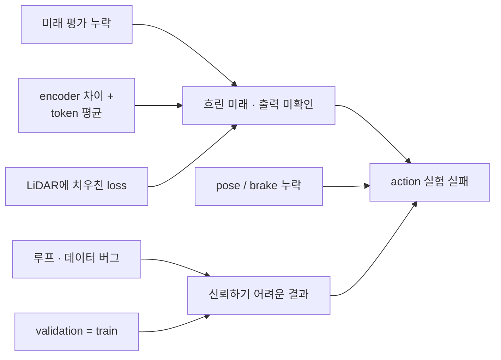
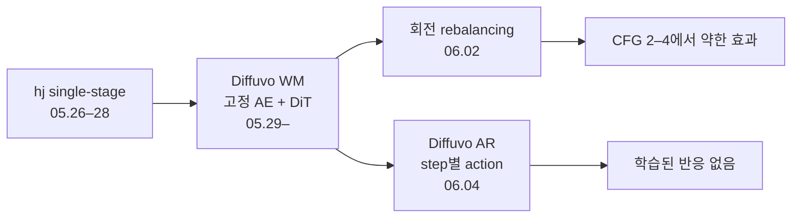
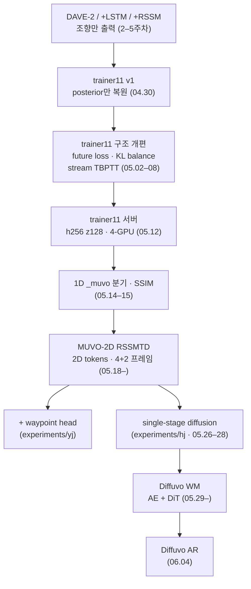

# 회고

[← README](../README_ko.md) · [English](postmortem.md) | **한국어**

world model 성능 한계 · 문제 발견 과정 · 개선 방향 정리

## 요약

| 번호 | 근본 원인 | 영향 | 발견 시점 | 상태 |
|---|---|---|---|---|
| 1 | 미래 학습 · 평가 누락 | 미래 출력 미확인 | 04.30 | MUVO-2D에서 MUVO 방식 복원 |
| 2 | MUVO와 다른 encoder · token을 단일 벡터로 평균 | 단일 window에서도 흐림 | 04.30 지적 · 05.14 원인 추적 | MUVO-2D로 교체 |
| 3 | 잘못된 전제로 SSIM 도입 | 격자무늬 또는 흐림 심화 | 05.15 | 제거 |
| 4 | 학습 루프 · 데이터 버그 | 잘못된 학습 신호 · 전체 데이터 run 오인 | 05.02–08 | 수정 |
| 5 | LiDAR에 치우친 loss | 전체 loss 중 RGB 항 < 1 % | 05.07 · 05.12 | 일부 가중치 조정 |
| 6 | 학습 데이터로 validation | 오해를 부르는 수치 | 05.02 · 05.14 · 05.24 | 매번 수정 |
| 7 | action 활용 미미 | action과 무관하게 같은 미래 | 05.27 실험 · 06.01–06 | 미해결 |
| 8 | 변환 과정에서 pose · brake 누락 | 근사 waypoint · brake 없음 | 05.27 | bicycle model로 근사 |

## 1. 미래 학습·평가 누락

| | |
|---|---|
| 증상 | 학습 진행 · 그럴듯한 복원 · 예측한 미래에 대한 평가 없음 |
| 발견 (04.30) | posterior만 복원하는 decoder · `imagine()` 미실행 · 정윤주 발견 |
| MUVO 방식 | 학습 시 posterior 복원 · prior는 KL로만 학습 · validation에서 imagined future 평가 |
| 초기 수정 | 정윤주 notebook에서 loss 수정(04.30) · 메인 notebook에는 미반영 · 05.02 구조 개편: 4 + 4 프레임 · future loss · KL 1e-3 + balancing · speed 입력 · LiDAR valid mask |
| 부작용 | decoder shortcut(05.02)으로 train / imagine 불일치 → 제거 · valid mask 적용 후 LiDAR 띠 발생 → 빈 픽셀 penalty 추가(05.05) |
| MUVO 방식 복원 (05.20) | MUVO-2D: reconstruction-only 학습 · validation에서 imagined future 평가 · trainer11은 future loss 유지 · 1D · 2D 수치의 학습 목표 상이 |
| 교훈 | 학습 전 핵심 출력 평가 방법 확정 |

## 2. latent 크기보다 encoder 경로가 병목

| | |
|---|---|
| 증상 | 단일 window overfit에서도 흐린 RGB |
| 초기 신호 | 2주차 MUVO 리뷰 · 03.25 노트의 2D token latent · 4주차 로드맵의 2D 가중치 · 04.30 global average pool 지적 |
| 진단 (05.13–15) | global average pool: 공간 token 약 300개 → 128차원 벡터 하나 · latent 크기 512로 확대해도 효과 없음 · LiDAR loss 제거도 효과 없음 |
| 실험 버그 | 05.13 overfit: 파일 22개에서 window 하나씩 사용 · 학습 데이터 시각화 · 1,000 epoch run 재개 시 schedule warmup 재적용 |
| 지연 원인 | 논문에 연결된 저장소는 1D 버전 · 별도 `2D` branch의 코드 존재 · AI 리뷰에서 미공개로 판단한 뒤 05.15 발견 |

- MUVO와 encoder 분해 비교(05.14 · 김채연)

| 구성 | 자체 구현(trainer11) | MUVO |
|---|---|---|
| 이미지 입력 | resize · 종횡비 왜곡 | crop |
| FPN | 가장 작은 map부터 top-down | bottom-up `DecoderDS` |
| token | 고정 grid로 추가 pooling | FPN 출력 그대로 사용 |
| fusion 이후 | global average pool → 1D 벡터 | 2D token(2D 버전) |
| 채널 수 | 128 channels | 256–512 |
| action | GRU 입력(Dreamer 방식) | prior / posterior에만 입력 |
| KL 가중치 | 1e-2 | 1e-3 |
| 학습 목표 | reconstruction + future loss | reconstruction-only 학습 |
| 복원 크기 | 224×288 출력을 216×288로 resize | 입력과 동일 |
| speed 배율 | ÷ 50 | ÷ 5 |

| | |
|---|---|
| 수정 | MUVO-2D: (B, S, C, N_tokens) 유지 · ConvGRU transition · transformer-decoder representation · LiDAR stride 16(token 128개) · speed를 fusion token으로 입력 |
| 남은 차이 | fusion layer 3개 · d 256 vs layer 6개 · d 384 · latent 256 vs 512 · token 368개 vs voxel 포함 약 1,093 · 4 + 2 프레임은 upstream 기본값 · 논문의 2D > 1D 결과는 6 + 6 설정 |
| 결과 (05.28) | 관측 PSNR 21.5 / 22.0 dB(trainer11보다 선명하나 여전히 흐림) · 미래 6 dB 하락 · val loss는 train의 3–3.5배 |

## 3. 잘못된 전제에서 출발한 SSIM

| | |
|---|---|
| 가정 | MUVO 선명도의 원인은 SSIM |
| 실제 | upstream 기본값은 SSIM 비활성화 · LiDAR / voxel loss와 augmentation으로 선명도 확보 · 자체 `_muvo`는 LiDAR loss 0 · augmentation 없음 |
| 결과 (05.15) | 0.6 = upstream 실효값 0.06의 10배 → loss 폭증 · 격자무늬 · 0.06 → 흐림 심화 · 2×2(latent × SSIM) 단일 window 실험 → 동일 |
| 교훈 | 아이디어 도입 전 reference 기본값 확인 · 단일 window overfit만으로 흐림 개선 평가 불가 |

## 4. 학습 루프·데이터 버그

| 날짜 | 버그 | 수정 |
|---|---|---|
| 05.02 | batch slot과 연속 stream 불일치(TBPTT) | `StreamWindowDataset` |
| 05.02 | 8프레임 window · stride 4 → TBPTT window 중첩 | stride RF × N(05.07) |
| 05.07 | 차원별 free bits clamp · 하한 약 64 nat | 합산 후 clamp |
| 05.07 | `imagine()` · window 간 action 한 step 밀림 | 마지막 관측 action 전달 |
| 05.07 | LiDAR pitch [−90°, 90°] 정규화 · 초기 32×256 크기 임의 설정 | CARLA 기본값 [−30°, 10°] · FOV 외부 mask |
| 05.08 | 전체 데이터 run에서 파일 하나만 학습 · 15k step ≈ 4 epoch | selector 수정 · 40 epoch run |
| 05.06 | timestamp 기준 0.4–0.8 Hz 추정 | 수집 스크립트 확인: wall clock · 4 Hz |
| 05.25 | 80 m 센서에 `LIDAR_SCALE` 50 복사 | 40으로 복원 · 빈 depth −0.02(06.01) |

## 5. LiDAR loss에 묻힌 RGB loss

| | |
|---|---|
| 05.12 이전 | 04.30 RGB 실효 가중치 0.05 지적 · RGB loss는 LiDAR의 1/1,000 미만 · RGB ×10 · LiDAR ×0.2 이후 RGB 가중치 1.0 · target 216×288 / 32×256 |
| 서버 run (05.12) | RGB 1.0 / LiDAR 1.0 · 최종 RL loss 중 LiDAR xyz 약 77 % · 약 120–130k step 이후 정체 |
| MUVO-2D | LiDAR loss 비활성화 후 0.1 · Chamfer 하락 중 LiDAR head가 띠 형태로 붕괴(05.28) · 유효 range-view 픽셀 약 14 % |
| 교훈 | 첫 run부터 loss 항별 비중 기록 · 출력 확인 |

## 6. 학습 데이터로 수행한 validation

| 시점 | 위치 | 내용 |
|---|---|---|
| 05.02 | trainer11 | 학습 파일로 validation → 별도 run 분리 |
| 05.14 | 1D 스크립트 | validation = 학습 데이터 · 기본값 8 samples |
| 05.24 | MUVO-2D 이식 | 동일 오류 · `--steps` 무시 · validation augmentation · 절반 해상도 지표 · imagined action 한 step 지연 · checkpoint 폴더 공유 · CSV 행 중복 |

- 수치 해석 시 유의점

- CSV 133행 = 서로 다른 run 103개 · smoke test · 재시작 · DDP 중복 포함
- RL / DS = MUVO split 이름을 따른 validation run 2개 · 날씨 · 경로 변화 검증 없음
- 해상도 · frame rate · sequence 길이 · LiDAR(32-ch / 80 m vs 64-ch / 100 m)가 논문과 상이 · MUVO 수치와 직접 비교 불가
- 초기 MUVO-2D 서버 run: 데이터 1/4 · 학습 데이터로 validation
- Diffuvo intervention 그림: 학습 window 사용

## 7. action을 바꿔도 거의 같은 미래

| 모델 | 결과 |
|---|---|
| single-stage diffusion (05.27–28) | 과거 복원 · 미래 복원 실패 · CFG 2에서 모든 action에 같은 모자이크 |
| Diffuvo WM (05.29–) | AE PSNR 22.5 / 23.1 dB(구조 유지 · 세부 흐림) · latent v-MSE 약 0.29–0.36 · rebalancing 전 CFG 2–7에서 action 구분 없음 · 이후 CFG 2–4에서 seed 잡음보다 큰 효과 · artifact 발생 |
| Diffuvo AR (06.04) | step별 action token · CFG A / B: 학습된 반응 없음 · 200 epoch run을 약 4 epoch에서 중단 |

| 요인별 실험 | 결과 |
|---|---|
| 정지 프레임 가중치 축소 | 악화 |
| 회전 ×3 · 정지 ×0.3 | 회전 비중 74 % · 최저 v-MSE 0.289 |
| latent 정규화 | 효과 없음 · 이미 단위 분산 · 되돌림 |
| 단일 window overfit | OneCycle 0.21에서 정체 · 고정 LR에서 0.117 도달 후 계속 하락 → 모델 용량이 아닌 LR anneal 문제 |
| action 연결 점검 | 통과 |

| | |
|---|---|
| 원인 | 미래 전체에 정규화하지 않은 action 하나(WM) · 중복 history와 0으로 초기화한 adaLN gate(AR) · 정지 프레임 42 % |
| 미실행 | 정규화 + memory token + memory dropout |
| 교훈 | action intervention 실험을 마지막이 아닌 시작 단계에 작성 |

## 8. pose 누락과 근사 waypoint

| | |
|---|---|
| 원본 데이터 | ego 위치 · 회전 · 속도 · brake |
| 자체 변환 | steer · throttle · speed만 보존 |
| 영향 | speed + steer 기반 bicycle model로 waypoint 정답 근사 · brake 부재로 policy head 제거 · action 실험의 brake = throttle 0 |
| waypoint head (05.25) | RSSMTD 기반 GRU decoder · ADE / FDE · 카메라 투영 · 정윤주 |
| 교훈 | 데이터 변환 과정에서 누락된 항목 확인 |

## 모델 계보

## 문제 해결 기록

| 날짜 | 문제 | 해결 |
|---|---|---|
| 04.02 | Lightning 2.1 설치 정체 | Lightning 2.0.1 유지 |
| 04.30 | cuDNN 로딩 중 kernel 종료 | 누락된 `libnvrtc` 링크 추가 |
| 04.30 | 첫 run 100,000 step 설정 | 20 epoch로 축소 |
| 05.07 | 서버 학습 시작 실패 | pickle manifest |
| 05.08 | 약 1 epoch 후 early stopping | 제거 후 40 epoch run |
| 05.12 | 4-GPU 실행 정체 · 기본 `ddp` 실패 | `ddp_find_unused_parameters_true` |
| 05.14 | OneCycle 재개 오류 | schedule 연장 |
| 05.14 | 절반 해상도 head 출력이 시각화됐을 가능성 | 전체 해상도 head 사용 · 흐림 동일 |
| 05.25 | RSSMTD overfit 중 `imagine` permute 오류 | 보고 · 수정 |
| 05.26 | 저장 메시지만 출력 · 그림 파일 없음 | `--figure-dir` · 경로 확인 |
| 05.28 | LiDAR 색상 범위로 지면 가려짐 | 범위 조정 |
| 05.29 | OneCycle 마지막 약 12k step 동안 1e-8 | 종료 LR 1e-6 |
| 06.02 | Diffuvo CPU 데이터 로딩 병목(약 70 %) | latent caching 제안 |
| 06.04 | float attention mask로 fused attention 비활성화 | 프레임별 reshape · 6.6배 가속 |

## 교훈

- **모델보다 실험 우선**: 출력 우선 정의(03.09) · action 실험(05.27) 요청 · 해당 실험 전 모델 3개 구현
- **reference 줄별 비교**: 05.14 encoder 분해 비교에서 대부분 문제 발견 · upstream 기본값 확인 후 SSIM 가정 폐기
- **초기 신호 대응**: 04.30 pooling · LiDAR 투영 지적 · 2주차 · 03.25 노트의 2D latent · 실제 수정은 5월 중순
- **데이터 변환 누락 확인**: 자체 변환에서 pose · brake 제거 후 데이터셋 한계로 오인
- **overfit 우선 · 단독 판단 금지**: 03.25 요청 · 05.14 첫 정상 단일 window overfit · 2D보다 1D에 유리 · SSIM 설정 간 차이 구분 불가
- **대규모 수정 후 재점검**: 코드베이스 3개에서 학습 데이터 validation 재발
- **표 기록**: 05.06 요청 다음 날 `experiment_log.csv` 도입
- **점수보다 근거**: 04.15부터 점수 개선보다 변경 이유 요구
