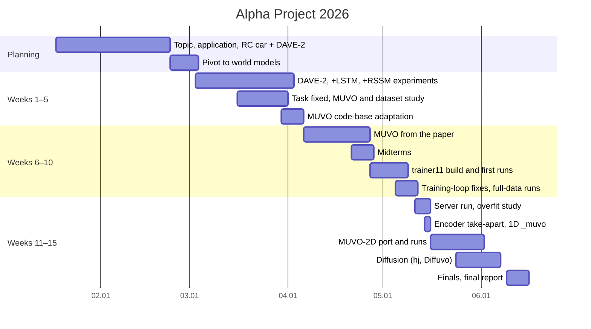
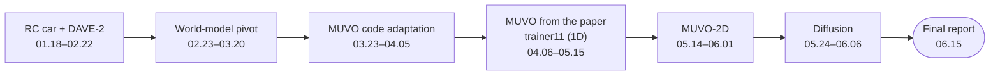

# Timeline

[← README](../README.md) · **English** | [한국어](timeline_ko.md)

From topic selection (01.18) to the final report (06.15) · week 1 = 2026-03-02

## At a Glance

## Phases

## Before the Semester

| Date | Event | Who |
|---|---|---|
| 01.19 | First advisor meeting · topic too heavy, end-to-end driving hard · look at CARLA-based papers or one 3D task | Oh, Park, Jeong |
| 01.20 | PiCar RTAS paper (RC car + DAVE-2 steering) found · basis of the next day's plan | Jeong |
| 01.21 | RC car + DAVE-2 + planning plan presented · advisor: closer to a competition than research, start with line tracing | Jeong |
| 01.23 | Application submitted · DAVE-2 steering, RC car, AI Hub data, camera only | Kim |
| 02.09 | First advisor meeting after selection arranged | Kim |
| 02.19–24 | RC-car hardware survey, team pre-meeting, compute options | Kim, team |
| 02.23 | **Pivot**: advisor points to world models, Dreamer, video prediction · Epona (diffusion world model) review shared | Kim |
| 02.28 | Dreaming / DreamerV3 meeting · follow World Models (2018), keep steering output · Dreamer series as lead candidate | Team, Jeong |

## Weeks 1–5 · From DAVE-2 to a MUVO-Style Task

| Date | Event | Who |
|---|---|---|
| 03.03 | Revised plan · DAVE-2 lane tracing → DAVE-2 encoder + RSSM + actor, world model from week 8 · CARLA as fallback data | Jeong (body), Kim (intro, data) |
| 03.05–06 | World Models (2018) read and summarised · output redefined as an action (steer, throttle, brake) · dataset candidates, SullyChen found | Park, Kim, Jeong |
| 03.09 | **Advisor meeting** · papers assigned: DriveGAN, MUVO, DriveDreamer, E2E-CARLA survey | Kim, Oh, Park, Jeong |
| 03.09–13 | DAVE-2 implemented on SullyChen data · Survey study | Kim (lead), Park |
| 03.16–20 | DAVE-2 + LSTM worse than DAVE-2 (R² −0.185 vs 0.145) · **task fixed: camera + LiDAR in, future RGB out** | Kim (lead), Park |
| 03.23 | TransFuser and the Hugging Face CARLA dataset found | Jeong, Kim |
| 03.25 | **Advisor meeting** · MUVO as the base | Team |
| 03.23–31 | MUVO code analysis, DAVE-2 + RSSM, environment, model spec for the server | Team, Park, Kim |
| 03.30–04.05 | MUVO code adapted to TransFuser data · data module port, config triage · dataset inventory (source has pose, brake) | Park, Jeong |

## Weeks 6–10 · MUVO From the Paper → trainer11

| Date | Event | Who |
|---|---|---|
| 04.06–10 | Direction survey (WorldVLM, MILE, YOLOv11-RGBT, trajectory pipeline) · **MUVO code dropped, build from the paper** · LiDAR as range view, HF data | Jeong, Oh, Kim, Park |
| 04.13 | Transition design, encoder notebooks, fusion → RSSM `forward()` · **first forward pass** | Park, Jeong, Kim |
| 04.15 | **Advisor meeting** · smaller model and inputs, decoder first | Team |
| 04.21–27 | Midterms | |
| 04.27 | Roles: dataset Kim, sequence model Jeong, image decoder Park, LiDAR decoder Oh | Kim |
| 04.29 | Time-series dataset · `trainer11.ipynb` + TBPTT | Kim, Jeong |
| 04.30 | **Decoder never produced the future** · full `WorldModelTrainer` · first local run · first git commit | Jeong, Park, Kim |
| 05.02 | Stream-aligned TBPTT, separate validation run · restructure: 4 + 4 frames, future loss, KL balance · LiDAR bands appear | Kim |
| 05.05 | Empty-pixel penalty | Kim |
| 05.06 | **Advisor meeting** · data proven 4 Hz from the collection script | Park (materials), Kim |
| 05.07 | MUVO metrics, checkpoint re-evaluation · **LiDAR projection fix** [−90°, 90°] → [−30°, 10°] · manifest, experiment log | Kim |
| 05.07–08 | Five review rounds (TBPTT overlap, free bits, action off by one) · one-file "all data" bug · 40-epoch full-data run | Kim |
| 05.11 | Change summary, modular layouts, server CLI export | Park, Jeong, Kim |

## Weeks 11–15 · 1D → 2D → Diffusion

| Date | Event | Who |
|---|---|---|
| 05.12 | **4-GPU DDP full-data run** · 12.1 h, val DS 23.23 / RL 32.64 · LiDAR ~77 % of the final RL loss | Kim |
| 05.13 | Encoder pooling replaced with BasicBlock · 150×200 run | Jeong |
| 05.14 | 22-window "overfit" caught · one-window series · **encoder taken apart against MUVO** · 1D `_muvo` branch | Kim, Park |
| 05.15 | SSIM test (negative) · 1D latent named as the main blur cause · code compared with MUVO · MUVO `2D` branch found | Kim, Park, Oh |
| 05.16 | **Switch to MUVO-2D**, advisor meeting moved to 05.27 | Team |
| 05.18 | MUVO-2D plan and port · 369 tokens, RSSMTD, action only in prior / posterior · Tailscale SSH access to the campus WSL and GPU server (2–3 days) | Kim |
| 05.19–20 | Code audits · difference list · reconstruction-only training as in MUVO · first quarter-data server runs | Kim, Park |
| 05.24 | Multi-agent review of the port · **DWM paper → diffusion direction** · UniAD | Kim, Oh, Jeong |
| 05.25 | Review fixes, upstream alignment · RSSMTD + waypoint head | Kim, Jeong, Park |
| 05.26–27 | **Single-stage diffusion overfits and design** (DiT, v-prediction, action CFG) | Oh |
| 05.27 | **Advisor meeting** · test the action | Team |
| 05.28 | Upstream evaluation bugs fixed · 200-epoch MUVO-2D run analysed (future −6 dB) | Kim |
| 05.29 | Full-data results, LR-tuned rerun · OneCycle dead-tail fix | Park, Kim |
| 05.29–06.06 | **Diffuvo WM / AR**: frozen AE + DiT, rebalancing, CFG probes, AR variant | Oh |
| 05.31–06.01 | KL sweeps for MUVO-2D · waypoint write-up, LTP summary | Kim, Jeong |
| 06.09–15 | Finals · final report due 06.15 | |

## Advisor Meetings

| Date | Key feedback |
|---|---|
| 01.19 | Re-scope the topic · CARLA needs compute · implement a paper, then modify it |
| 01.21 | Start small (line tracing) · a clear goal makes it research |
| 02.23 | World models, Dreamer, video prediction |
| 03.09 | Output first, then model · image first, then control · RL not required |
| 03.25 | Code at framework level · one dataset and modality, small subset · **overfit first** · split roles |
| 04.08 | Postponed |
| 04.15 | Fewer layers, smaller inputs · decoder first · try things for a reason |
| 05.06 | Find the bottleneck · LR first · 1/8 targets, 2 Hz · baseline model · results in tables |
| 05.27 | **Change the action and check the future** · DDPM · reason about why · record every change |

## Notes

- Sources: team chat, Notion meeting and weekly pages, meeting memos, git history, `results/experiment_log.csv`, Codex logs
- Notion week-15 page dates the diffusion work 06.09–13 · run logs: 05.29–06.06
- Technical details of each event: [postmortem](postmortem.md) · per-member detail: [contributions](contributions.md)
