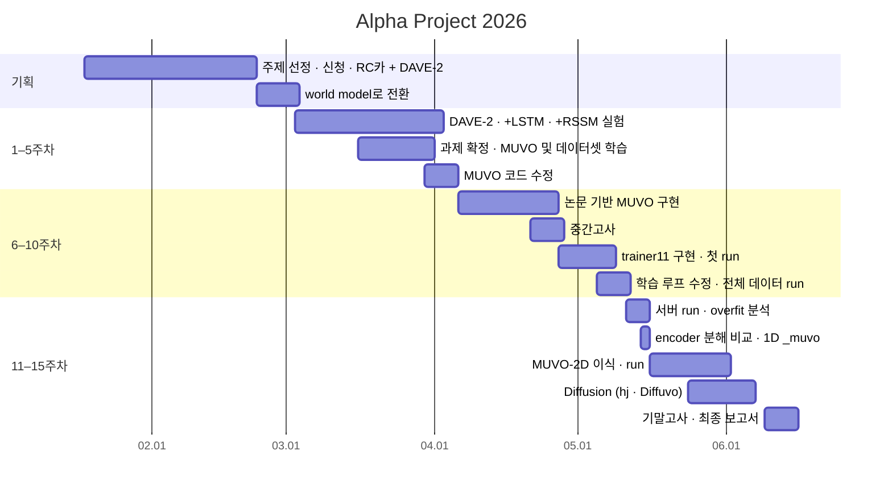
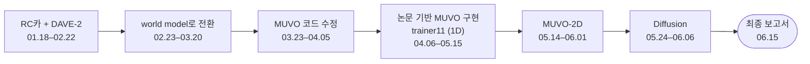

# 진행 일정

[← README](../README_ko.md) · [English](timeline.md) | **한국어**

주제 선정(01.18)부터 최종 보고서(06.15)까지의 기록(1주차 = 2026-03-02)

## 전체 일정

## 단계별 흐름

## 개강 전

| 날짜 | 내용 | 담당 |
|---|---|---|
| 01.19 | 첫 교수님 미팅 · 과도한 범위와 end-to-end 주행 난도 지적 · CARLA 논문 또는 단일 3D 과제 검토 | 오효정 · 박시현 · 정윤주 |
| 01.20 | PiCar RTAS 논문 발견(RC카 + DAVE-2 조향) · 다음 날 계획안의 기반 | 정윤주 |
| 01.21 | RC카 + DAVE-2 + 경로 계획안 발표 · 교수님 피드백: 연구보다 대회에 가까운 구성 · 라인 트레이싱부터 시작 | 정윤주 |
| 01.23 | 신청서 제출 · DAVE-2 조향 · RC카 · AI Hub 데이터 · 카메라만 사용 | 김채연 |
| 02.09 | 선정 후 첫 교수님 미팅 조율 | 김채연 |
| 02.19–24 | RC카 하드웨어 조사 · 팀 사전 미팅 · 연산 자원 검토 | 김채연 · 팀 전체 |
| 02.23 | **방향 전환**: 교수님 제안으로 world model · Dreamer · 영상 예측 검토 · Epona(diffusion world model) 리뷰 공유 | 김채연 |
| 02.28 | Dreaming / DreamerV3 미팅 · World Models (2018) 기반 · 조향 출력 유지 · Dreamer 계열 우선 검토 | 팀 전체 · 정윤주 |

## 1–5주차 · DAVE-2에서 MUVO 방식 과제로

| 날짜 | 내용 | 담당 |
|---|---|---|
| 03.03 | 수정 계획 · DAVE-2 차선 추종 → DAVE-2 encoder + RSSM + actor · 8주차부터 world model · 대체 데이터로 CARLA | 정윤주(본문) · 김채연(서론 · 데이터) |
| 03.05–06 | World Models (2018) 학습 · 요약 · 출력을 action(steer · throttle · brake)으로 재정의 · 데이터셋 후보 조사 · SullyChen 발견 | 박시현 · 김채연 · 정윤주 |
| 03.09 | **교수님 미팅** · DriveGAN · MUVO · DriveDreamer · E2E-CARLA survey 분담 | 김채연 · 오효정 · 박시현 · 정윤주 |
| 03.09–13 | SullyChen 데이터로 DAVE-2 구현 · Survey 학습 | 김채연(주도) · 박시현 |
| 03.16–20 | DAVE-2 + LSTM이 DAVE-2보다 성능 낮음(R² −0.185 vs 0.145) · **과제 확정: 카메라 + LiDAR 입력 → 미래 RGB 출력** | 김채연(주도) · 박시현 |
| 03.23 | TransFuser · Hugging Face CARLA 데이터셋 발견 | 정윤주 · 김채연 |
| 03.25 | **교수님 미팅** · MUVO 기반으로 결정 | 팀 전체 |
| 03.23–31 | MUVO 코드 분석 · DAVE-2 + RSSM · 환경 구성 · 서버용 모델 사양 정리 | 팀 전체 · 박시현 · 김채연 |
| 03.30–04.05 | TransFuser 데이터에 맞춰 MUVO 수정 · 데이터 모듈 이식 · config 선별 · 원본 데이터 항목 확인(pose · brake 포함) | 박시현 · 정윤주 |

## 6–10주차 · 논문 기반 MUVO 구현 → trainer11

| 날짜 | 내용 | 담당 |
|---|---|---|
| 04.06–10 | 방향 조사(WorldVLM · MILE · YOLOv11-RGBT · 궤적 파이프라인) · **MUVO 코드 활용 중단 · 논문 기반 직접 구현** · LiDAR range view · Hugging Face 데이터 채택 | 정윤주 · 오효정 · 김채연 · 박시현 |
| 04.13 | transition 설계 · encoder notebook · fusion → RSSM `forward()` · **첫 forward pass** | 박시현 · 정윤주 · 김채연 |
| 04.15 | **교수님 미팅** · 모델 · 입력 축소 · decoder 우선 구현 | 팀 전체 |
| 04.21–27 | 중간고사 | |
| 04.27 | 역할 분담: 데이터셋 김채연 · sequence model 정윤주 · 이미지 decoder 박시현 · LiDAR decoder 오효정 | 김채연 |
| 04.29 | 시계열 데이터셋 · `trainer11.ipynb` + TBPTT | 김채연 · 정윤주 |
| 04.30 | **decoder의 미래 출력 누락 발견** · `WorldModelTrainer` 전체 구현 · 첫 로컬 run · 첫 git commit | 정윤주 · 박시현 · 김채연 |
| 05.02 | stream 정렬 TBPTT · 별도 validation run · 4 + 4 프레임 구조로 개편 · future loss · KL balance · LiDAR 띠 발생 | 김채연 |
| 05.05 | 빈 픽셀 penalty 추가 | 김채연 |
| 05.06 | **교수님 미팅** · 수집 스크립트에서 데이터 4 Hz 확인 | 박시현(자료) · 김채연 |
| 05.07 | MUVO 지표 · checkpoint 재평가 · **LiDAR 투영 수정** [−90°, 90°] → [−30°, 10°] · manifest · 실험 로그 | 김채연 |
| 05.07–08 | 리뷰 5회(TBPTT 중첩 · free bits · action 한 step 밀림) · 전체 데이터 run의 단일 파일 버그 발견 · 전체 데이터 40 epoch run | 김채연 |
| 05.11 | 변경 사항 요약 · 모듈 구성 · 서버 CLI 추출 | 박시현 · 정윤주 · 김채연 |

## 11–15주차 · 1D → 2D → Diffusion

| 날짜 | 내용 | 담당 |
|---|---|---|
| 05.12 | **4-GPU DDP 전체 데이터 run** · 12.1 h · val DS 23.23 / RL 32.64 · 최종 RL loss 중 LiDAR 약 77 % | 김채연 |
| 05.13 | encoder pooling을 BasicBlock으로 교체 · 150×200 run | 정윤주 |
| 05.14 | window 22개를 사용한 overfit 실험 오류 발견 · 단일 window 실험 · **MUVO와 encoder 분해 비교** · 1D `_muvo` 분기 | 김채연 · 박시현 |
| 05.15 | SSIM 실험(효과 없음) · 흐림의 주원인으로 1D latent 지목 · MUVO 코드 비교 · MUVO `2D` branch 발견 | 김채연 · 박시현 · 오효정 |
| 05.16 | **MUVO-2D 전환** · 교수님 미팅 05.27로 연기 | 팀 전체 |
| 05.18 | MUVO-2D 계획 · 이식 · token 369개 · RSSMTD · prior / posterior에만 action 입력 · 교내 WSL · GPU 서버 Tailscale SSH 접속 구축(2–3일) | 김채연 |
| 05.19–20 | 코드 점검 · 차이 목록 · MUVO와 동일한 reconstruction-only 학습 · 데이터 1/4로 첫 서버 run | 김채연 · 박시현 |
| 05.24 | 이식 코드 multi-agent 리뷰 · **DWM 논문 → diffusion 방향 설정** · UniAD | 김채연 · 오효정 · 정윤주 |
| 05.25 | 리뷰 수정 · upstream 구현에 맞춤 · RSSMTD + waypoint head | 김채연 · 정윤주 · 박시현 |
| 05.26–27 | **single-stage diffusion overfit · 설계**(DiT · v-prediction · action CFG) | 오효정 |
| 05.27 | **교수님 미팅** · action 변경 실험 제안 | 팀 전체 |
| 05.28 | upstream 평가 버그 수정 · MUVO-2D 200 epoch run 분석(미래 −6 dB) | 김채연 |
| 05.29 | 전체 데이터 결과 · LR 조정 후 재실행 · OneCycle 후반 학습 정체 수정 | 박시현 · 김채연 |
| 05.29–06.06 | **Diffuvo WM / AR**: 고정 AE + DiT · rebalancing · CFG 실험 · AR 변형 | 오효정 |
| 05.31–06.01 | MUVO-2D KL sweep · waypoint 문서 · LTP 요약 | 김채연 · 정윤주 |
| 06.09–15 | 기말고사 · 최종 보고서 마감 06.15 | |

## 교수님 미팅

| 날짜 | 주요 피드백 |
|---|---|
| 01.19 | 주제 범위 축소 · CARLA 연산 자원 필요 · 논문 구현 후 수정 |
| 01.21 | 라인 트레이싱부터 시작 · 명확한 연구 목표 설정 |
| 02.23 | world model · Dreamer · 영상 예측 |
| 03.09 | 출력 정의 후 모델 선정 · 이미지 후 제어 · RL 필수 아님 |
| 03.25 | framework 수준 코드 작성 · 단일 데이터셋 · 단일 modality · 소규모 subset · **overfit 우선** · 역할 분담 |
| 04.08 | 연기 |
| 04.15 | layer · 입력 축소 · decoder 우선 · 근거 있는 실험 |
| 05.06 | 병목 파악 · LR 우선 · target 1/8 · 2 Hz · baseline 모델 · 결과 표 정리 |
| 05.27 | **action 변경 후 미래 확인** · DDPM · 원인 분석 · 변경 사항 전부 기록 |

## 참고

- 출처: 팀 채팅 · Notion 미팅 · 주차별 페이지 · 미팅 메모 · git 이력 · `results/experiment_log.csv` · Codex 로그
- Notion 15주차 페이지의 diffusion 작업일 06.09–13 · run 로그상 05.29–06.06
- 사건별 기술 내용: [회고](postmortem_ko.md) · 팀원별 상세: [기여 내역](contributions_ko.md)
